# **ROS数据展示系统**

## ***一，用命令行窗口显示小车的IMU和里程计（odometry）数据***
>    1. **显示IMU数据**
>    >    * 启动ROS
>    >    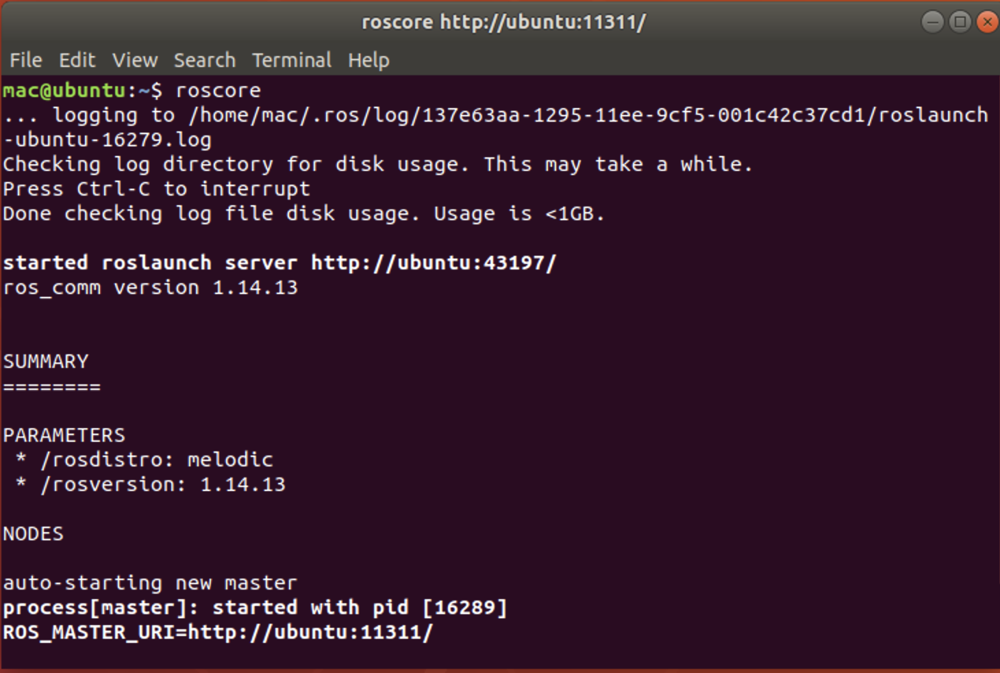
>    >    * 播放bag包数据
>    >    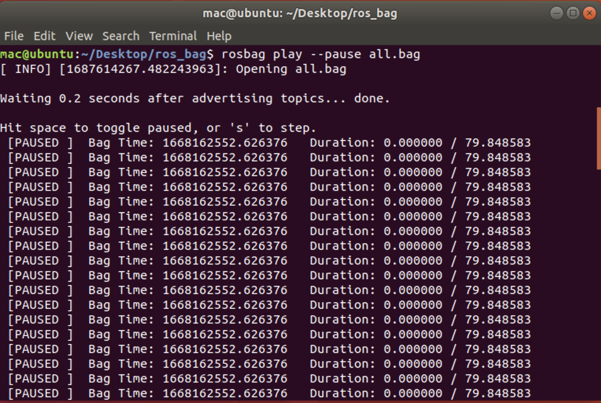
>    >    * 查看topic
>    >    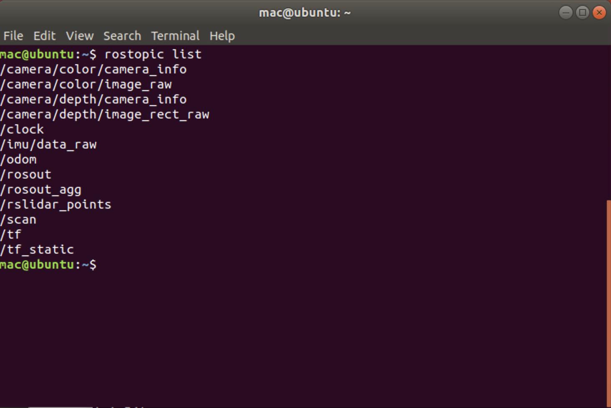
>    >    * 查看话题消息的类型
>    >    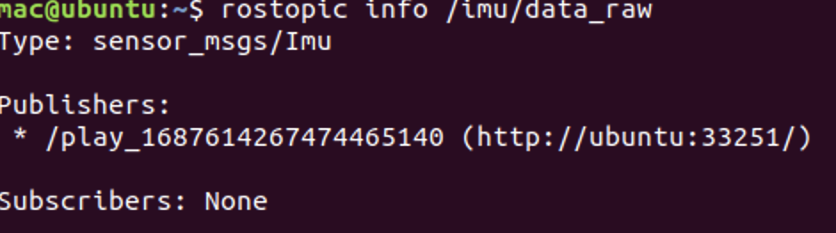
>    >    * 显示消息具体内容
>    >    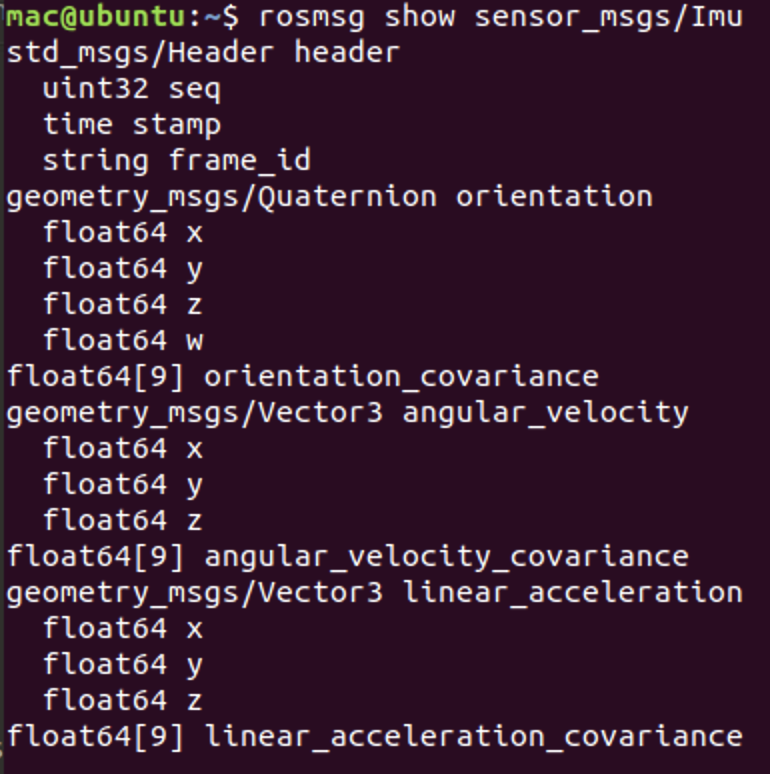
>    >    * 根据消息内容编写回调函数输出消息
>    >    >```c++
>    >    >void callback(const sensor_msgs::Imu::ConstPtr& ptr)
>    >    >{
>    >    >    std::cout << "std_msgs/Header header" << std::endl;
>    >    >    std::cout << "    uint32 seq: " << ptr->header.seq << std::endl;
>    >    >   std::cout << "    time stamp: " << ptr->header.stamp << std::endl;
>    >    >   std::cout << "    string frame_id: " << ptr->header.frame_id << std::endl;
>    >    >    std::cout << "geometry_msgs/Quaternion orientation" << std::endl;
>    >    >    std::cout << "    float64 x: " << ptr->orientation.x << std::endl;
>    >    >    std::cout << "    float64 y: " << ptr->orientation.y << std::endl;
>    >    >    std::cout << "    float64 z: " << ptr->orientation.z << std::endl;
>    >    >    std::cout << "    float64 w: " << ptr->orientation.w << std::endl;
>    >    >    std::cout << "float64[9] orientation_covariance" << std::endl;
>    >    >    std::cout << "    ";
>    >    >    for (int i = 0; i < 9; ++i) {
>    >    >        std::cout << ptr->orientation_covariance[i] << " ";
>    >    >    }
>    >    >    std::cout << std::endl;
>    >    >    std::cout << "geometry_msgs/Vector3 angular_velocity" << std::endl;
>    >    >    std::cout << "    float64 x: " << ptr->angular_velocity.x << std::endl;
>    >    >    std::cout << "    float64 y: " << ptr->angular_velocity.y << std::endl;
>    >    >    std::cout << "    float64 z: " << ptr->angular_velocity.z << std::endl;
>    >    >    std::cout << "float64[9] angular_velocity_covariance" << std::endl;
>    >    >    std::cout << "    ";
>    >    >    for (int i = 0; i < 9; ++i) {
>    >    >        std::cout << ptr->angular_velocity_covariance[i] << " ";
>    >    >    }
>    >    >    std::cout << std::endl;
>    >    >    std::cout << "geometry_msgs/Vector3 linear_acceleration" << std::endl;
>    >    >    std::cout << "    float64 x: " << ptr->linear_acceleration.x << std::endl;
>    >    >    std::cout << "    float64 y: " << ptr->linear_acceleration.y << std::endl;
>    >    >    std::cout << "    float64 z: " << ptr->linear_acceleration.z << std::endl;
>    >    >    std::cout << "float64[9] linear_acceleration_covariance" << std::endl;
>    >    >    std::cout << "    ";
>    >    >    for (int i = 0; i < 9; ++i) {
>    >    >        std::cout << ptr->linear_acceleration_covariance[i] << " ";
>    >    >    }
>    >    >    std::cout << std::endl;
>    >    >    std::cout << "-------------------------------------------------------------" >    >     << std::endl;
>    >    >    return ;
>    >    >}
>    >    >```
>    >    * 订阅IMU话题
>    >    >```c++
>    >    >int main(int argc, char** argv)
>    >    >{
>    >    >   ros::init(argc, argv, "show_imu");
>    >    >   ros::NodeHandle nodeHandle;
>    >    >   ros::Subscriber subscriber = nodeHandle.subscribe("/imu/data_raw", 1000, callback);
>    >    >    ros::spin();
>    >    >    return 0;
>    >    >}
>    >    >```
>    >    * 运行show_imu
>    >    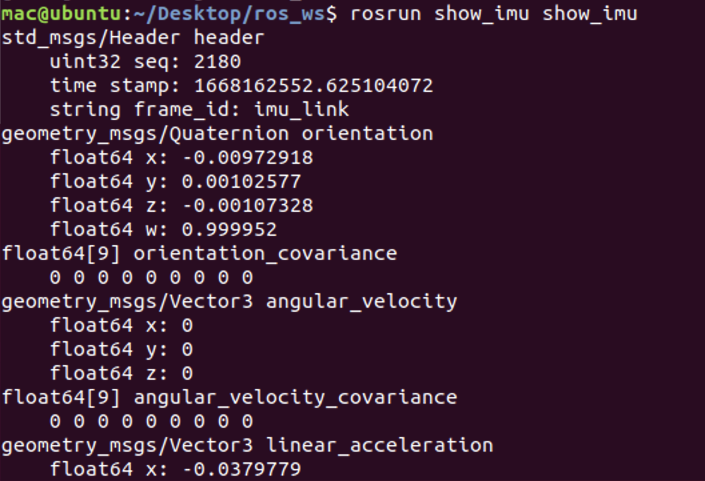
>    2. **显示里程计数据**
>    >    * 查看话题消息的类型
>    >    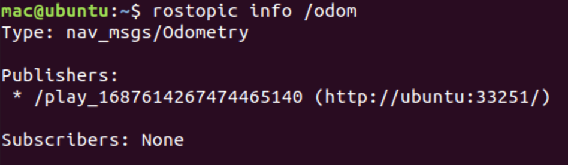
>    >    * 显示消息具体内容
>    >    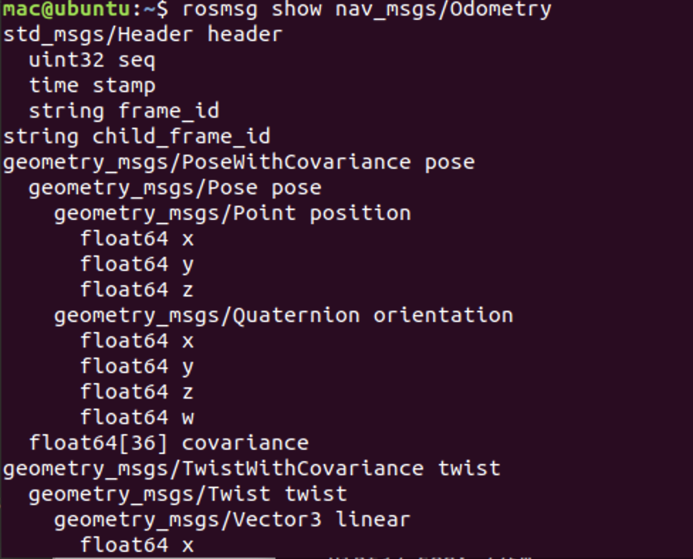
>    >    * 根据消息内容编写回调函数输出消息
>    >    >```c++
>    >    >void callback(const nav_msgs::Odometry::ConstPtr& ptr)
>    >    >{
>    >    >    std::cout << "std_msgs/Header header" << std::endl;
>    >    >    std::cout << "    uint32 seq: " << ptr->header.seq << std::endl;
>    >    >    std::cout << "    time stamp: " << ptr->header.stamp << std::endl;
>    >    >    std::cout << "    string frame_id: " << ptr->header.frame_id << std::endl;
>    >    >    std::cout << "string child_frame_id: " << ptr->child_frame_id << std::endl;
>    >    >    std::cout << "geometry_msgs/PoseWithCovariance pose" << std::endl;
>    >    >    std::cout << "    geometry_msgs/Pose pose" << std::endl;
>    >    >    std::cout << "        geometry_msgs/Point position" << std::endl;
>    >    >    std::cout << "        float64 x: " << ptr->pose.pose.position.x << std::endl;
>    >    >    std::cout << "        float64 y: " << ptr->pose.pose.position.y << std::endl;
>    >    >    std::cout << "        float64 z: " << ptr->pose.pose.position.z << std::endl;
>    >    >    std::cout << "    geometry_msgs/Quaternion orientation" << std::endl;
>    >    >    std::cout << "        float64 x: " << ptr->pose.pose.orientation.x << std::endl;
>    >    >    std::cout << "        float64 y: " << ptr->pose.pose.orientation.y << std::endl;
>    >    >    std::cout << "        float64 z: " << ptr->pose.pose.orientation.z << std::endl;
>    >    >    std::cout << "        float64 w: " << ptr->pose.pose.orientation.w << std::endl;
>    >    >    std::cout << "    float64[36] covariance" << std::endl;
>    >    >    std::cout << "        " << std::endl;
>    >    >    for (int i = 0; i < 36; ++i) {
>    >    >       std::cout << ptr->pose.covariance[i] << " ";
>    >    >    }
>    >    >    std::cout << std::endl;
>    >    >    std::cout << "geometry_msgs/TwistWithCovariance twist" << std::endl;
>    >    >    std::cout << "    geometry_msgs/Twist twist" << std::endl;
>    >    >    std::cout << "        geometry_msgs/Vector3 linear" << std::endl;
>    >    >    std::cout << "            float64 x: " << ptr->twist.twist.linear.x << std::endl;
>    >    >    std::cout << "            float64 y: " << ptr->twist.twist.linear.y << std::endl;
>    >    >    std::cout << "            float64 z: " << ptr->twist.twist.linear.z << std::endl;
>    >    >    std::cout << "        geometry_msgs/Vector3 angular" << std::endl;
>    >    >    std::cout << "            float64 x: " << ptr->twist.twist.angular.x << std::endl;
>    >    >    std::cout << "            float64 y: " << ptr->twist.twist.angular.y << std::endl;
>    >    >    std::cout << "            float64 z: " << ptr->twist.twist.angular.z << std::endl;
>    >    >    std::cout << "    float64[36] covariance" << std::endl;
>    >    >    std::cout << "        " << std::endl;
>    >    >    for (int i = 0; i < 36; ++i) {
>    >    >        std::cout << ptr->twist.covariance[i] << " ";
>    >    >    }
>    >    >    std::cout << std::endl;
>    >    >    std::cout << "-------------------------------------------------------------" << std::endl;
>    >    >    return ;
>    >    >}
>    >    >```
>    >    * 订阅里程计话题
>    >    >    ```c++
>    >    >    int main(int argc, char** argv)
>    >    >    {
>    >    >        ros::init(argc, argv, "show_odometry");
>    >    >        ros::NodeHandle nodeHandle;
>    >    >        ros::Subscriber subscriber = nodeHandle.subscribe("/odom", 1000, callback);
>    >    >        ros::spin();
>    >    >        return 0;
>    >    >    }
>    >    >    ```
>    >    * 运行show_odometry
>    >    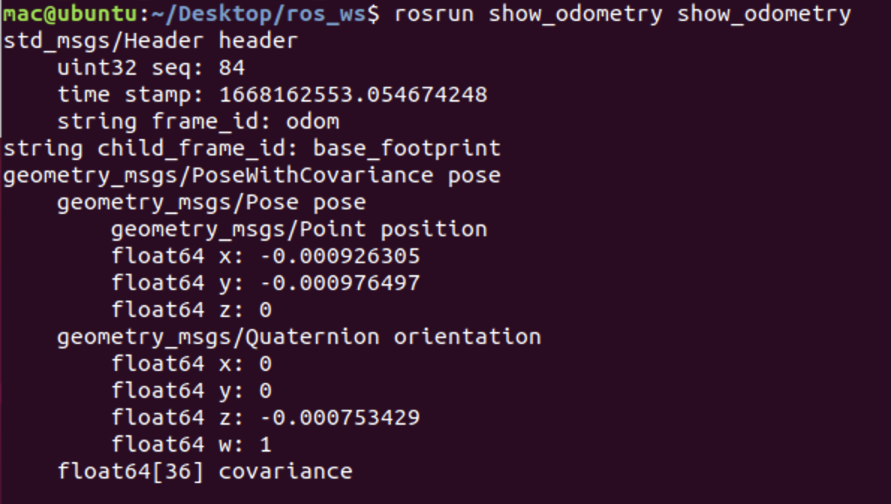
## ***二，用图形界面显示颜色相机和深度相机的数据（利用OpenCV库）***
>    1. **安装OpenCV库**
>    >    ```bash
>    >    mac@ubuntu:~$ sudo apt-get update
>    >    mac@ubuntu:~$ sudo apt-get upgrade
>    >    mac@ubuntu:~$ sudo apt-get install libopencv-dev
>    >    mac@ubuntu:~$ sudo apt-get install libopencv-contrib-dev
>    >    ```
>    2. **显示颜色相机数据**
>    >    * 查看话题消息的类型
>    >    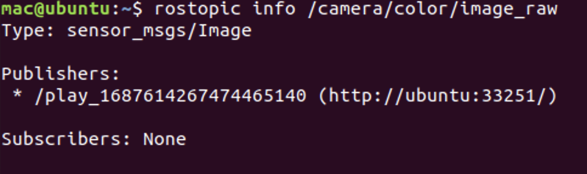
>    >    * 显示消息具体内容
>    >    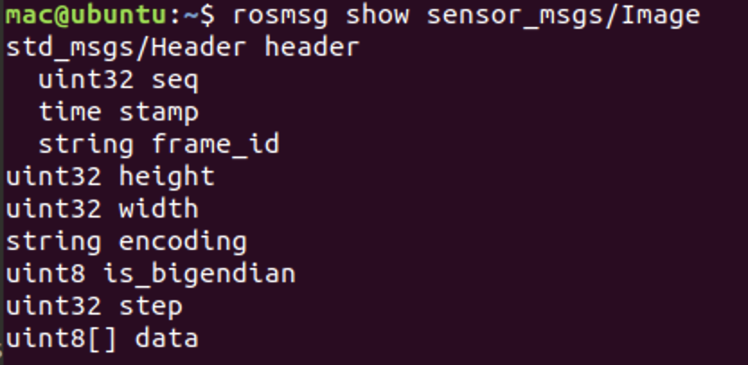
>    >    * 根据消息内容编写回调函数输出消息
>    >    >    ```c++
>    >    >    void callback(const sensor_msgs::ImageConstPtr& ptr)
>    >    >    {
>    >    >        cv_bridge::CvImagePtr cv_ptr;
>    >    >        try {
>    >    >            cv_ptr = cv_bridge::toCvCopy(ptr, sensor_msgs::image_encodings::BGR8);
>    >    >        } catch (cv_bridge::Exception& e) {
>    >    >            ROS_ERROR("cv_bridge exception: %s", e.what());
>    >    >            return ;
>    >    >        }
>    >    >        cv::imshow("color_camera", cv_ptr->image);
>    >    >        cv::waitKey(1);
>    >    >        return ;
>    >    >    }
>    >    >    ```
>    >    * 订阅颜色相机话题
>    >    >    ```c++
>    >    >    int main(int argc, char** argv)
>    >    >    {
>    >    >        ros::init(argc, argv, "show_color_camera");
>    >    >        ros::NodeHandle nodeHandle;
>    >    >        image_transport::ImageTransport imageTransport(nodeHandle);
>    >    >        image_transport::Subscriber subscriber = imageTransport.subscribe("/camera/color/image_raw", 1000, callback);
>    >    >        ros::spin();
>    >    >        return 0;
>    >    >    }
>    >    >    ```
>    >    * 运行show_color_camera
>    >    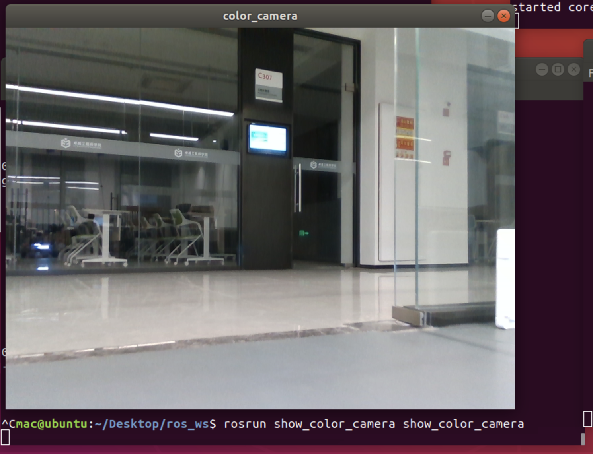
>    3. **显示深度相机数据**
>    >    显示深度相机数据的代码与显示颜色相机一样，只是图像编码不同而已。一个是BGR图像，一个是灰度图像。
>    >    ```c++
>    >    cv_ptr = cv_bridge::toCvCopy(ptr, sensor_msgs::image_encodings::TYPE_16UC1);
>    >    ```
>    >    * 运行show_depth_camera
>    >    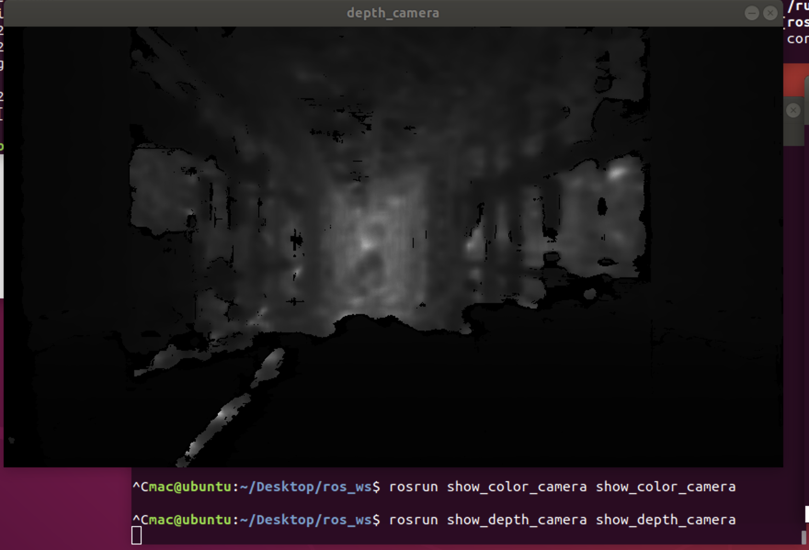
## ***三，用图形界面显示激光雷达的点云数据（利用PCL库）***
>    * 安装PCL库
>    ```bash
>    mac@ubuntu:~$ sudo apt-get update
>    mac@ubuntu:~$ sudo apt-get upgrade
>    mac@ubuntu:~$ sudo apt-get install libpcl-dev
>    ```
>    * 查看话题消息的类型
>    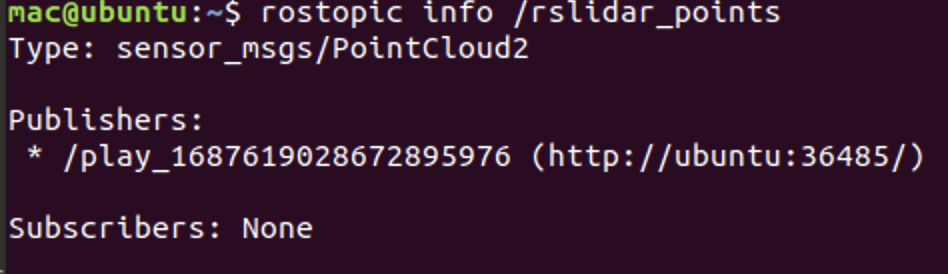
>    * 将ROS消息转换成点云显示出来
>    ```c++
>    void callback(const sensor_msgs::PointCloud2::ConstPtr& msg)
>    {
>        pcl::PointCloud<pcl::PointXYZ> cloud;
>        pcl::PCLPointCloud2 pcl_pc;
>        pcl_conversions::toPCL(*msg, pcl_pc);
>        pcl::fromPCLPointCloud2(pcl_pc, cloud);
>        viewer.showCloud(cloud.makeShared());
>    }
>    ```
>    * 运行show_point_cloud
>    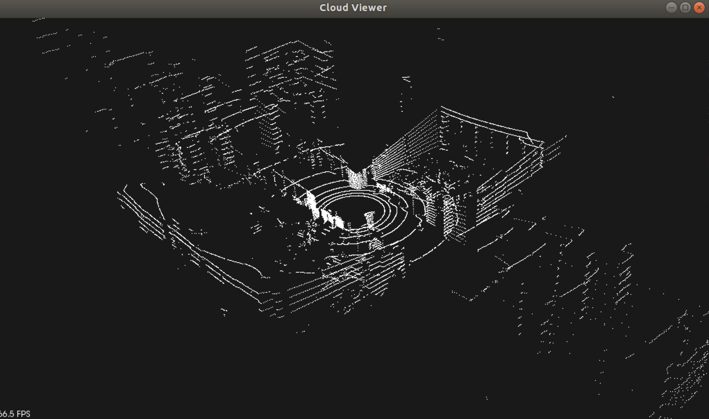
## ***四，GMapping建图***
>    * 安装gmapping
>    ```bash
>    mac@ubuntu:~$ sudo apt-get update
>    mac@ubuntu:~$ sudo apt-get upgrade
>    mac@ubuntu:~$ sudo apt-get install ros-melodic-gmapping
>    ```
>    * 查询nav_msgs/OccupancyGrid.msg消息定义
>    ```py
>    # This represents a 2-D grid map, in which each cell represents the probability of
>    # occupancy.
>    
>    Header header 
>    
>    #MetaData for the map
>    MapMetaData info
>    
>    # The map data, in row-major order, starting with (0,0).  Occupancy
>    # probabilities are in the range [0,100].  Unknown is -1.
>    int8[] data
>    ```
>    * 启动gmapping
>    ```c++
>    void LaunchGMapping()
>    {
>        system("rosrun gmapping slam_gmapping");
>    } 
>    ```
>    * 利用opencv绘制2D地图
>    ```c++
>    void callback(const nav_msgs::OccupancyGrid::ConstPtr& ptr)
>    {   
>        std::cout << "resolution: " << ptr->info.resolution << std::endl;
>        std::cout << "width: " << ptr->info.width << std::endl;
>        std::cout << "height: " << ptr->info.height << std::endl;
>        double scale = 1.0;
>        int width = 1200;
>        int height = 1200;
>        cv::Point offset = {-1600, -1600};
>        cv::Mat map = cv::Mat::zeros(cv::Size(width, height), CV_8UC3);
>        for (int i = 0; i < ptr->info.width * ptr->info.height; ++i) {
>            int x = (i % ptr->info.width + offset.x) * scale, y = (i / ptr->info.width + offset.y) * scale;
>            if (ptr->data[i] == -1) {
>                cv::circle(map, cv::Point(x, y), 1, cv::Scalar(255, 255, 255), -1);
>            } else if (ptr->data[i] >= 80) {
>                cv::circle(map, cv::Point(x, y), 3, cv::Scalar(0, 0, 0), -1);
>            } else {
>                cv::circle(map, cv::Point(x, y), 3, cv::Scalar(0, 255, 0), -1);
>            }    
>        }
>        cv::imshow("map", map);
>        cv::waitKey(1000);
>        return ;
>    }
>    ```
>    * 建图结果
>    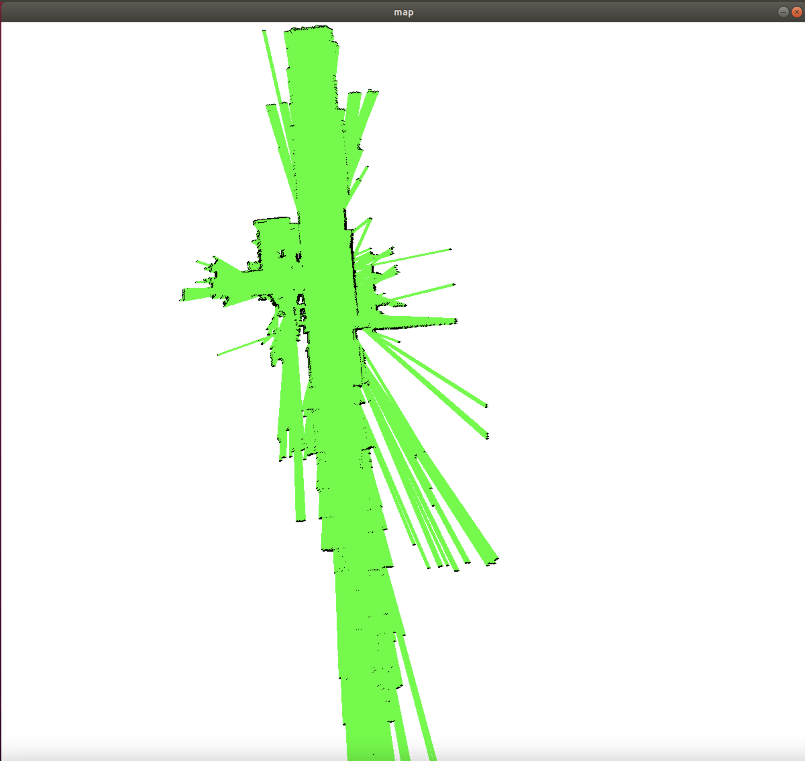